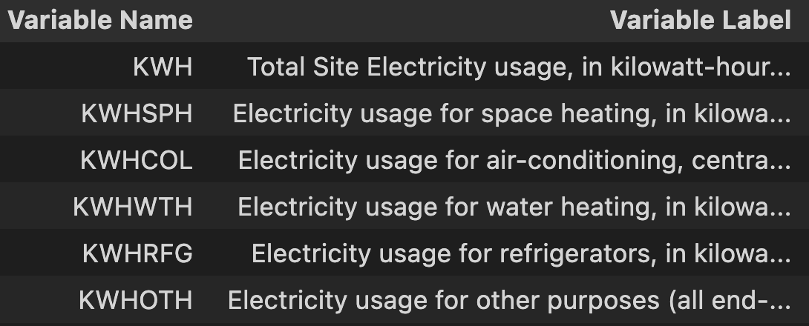
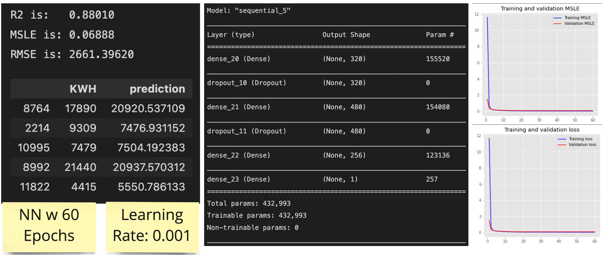

# **KWH Prediction Report**
### ***Goal**: Build a model that predicts electricity consumption*

## **Approach**:
1. Explore and understand the dataset
2. Data Engineering: Cleaning / Feature Engineering / Pipeline
3. Baseline model (Linear Regression)
4. Evaluate, adjust pipeline & test various models
5. Bonus

**General Comment**:  
One of the challenges with this data was understanding and forming an assumption around what features you would have access to when predicting the target variable.  

# **Findings:**

## 1. **EDA**

For this model we will be using the [2009 RESIDENTIAL ENERGY CONSUMPTION SURVEY (RECS) Survey Data](https://www.eia.gov/consumption/residential/data/2009/index.php?view=microdata). This is data collected by the U.S. Energy Information Administration. 

Data Tables:
| File Name                      	| Shape        	| Description                                                   	|
|--------------------------------	|--------------	|---------------------------------------------------------------	|
| [recs2009_public.csv](https://www.eia.gov/consumption/residential/data/2009/csv/recs2009_public.csv)            	| (12083, 940) 	| Sample represents 113.6 million U.S. households in 2009       	|
| [public_layout.csv](https://www.eia.gov/consumption/residential/data/2009/csv/public_layout.csv)              	| (940, 5)     	| Descriptive labels and formats for each data variable         	|
| [recs2009_public_repweights.csv](https://www.eia.gov/consumption/residential/data/2009/csv/recs2009_public_repweights.csv) 	| (12083, 246) 	| Replicate weights for each of the 12,083 RECS household cases 	|

For the timeline of this mini project I focused on using the first 2 tables. However, for model improvement I would look at utilizing data from the weights table to test for improvements in the model.

  

### **Inital Data Comments**:
[public table](https://www.eia.gov/consumption/residential/data/2009/csv/recs2009_public.csv) 

1. As there are 940 columns we need to be more programmatic to how we handle data. Taking the time to review each feature would be a large investment and in the business would usually we would leverage an SME for to expedite understanding as project is being done. 

2. There is dataleak around the target variable which needed investigation

3. There are many columns with multicollinearity 

4. Data types should be confirmed for modeling (categorical, continuous, ordinal, nominal etc)

5. What features will be available for prediction? This was probably the hardest to answer, thus working to understand the data was critical for this model.

 

### **Target Variable:** 'KWH'

Through exploring the data it was found that there are other columns which are subsets of the target variable. 

**Assumption**: We would not have access to this data when making the prediction due to it being dependent on the target variable of KWH. Anything following this logic was dropped as part of data processing.

 

### **-2 Values:** There are a lot of them
There was a lot of occurrences of -2 in many columns. The below example shows column names and their count of -2 values. Remembering that there is 12083 rows in this dataset, many columns contain -2 as most of their values. 

 

Most of these columns are data that is only collected in some observations. For example, the "AGEHHMEMCAT14" feature indicates if there is a 14th household member. Most household members do not have 14 people and thus, "-2" is input. 

**Assumption**: when -2 is present in large quantities for a feature, it represents a *NULL* value. For the pipeline of this model I removed columns where most of the data was *NULL*

 

### **Low Unique Value Count:**
In my search to understand the data I was investigating columns that were potentially Ordinal or Nominal. I discovered that many columns are flags as also seen in the "-2" example above.  

 

### **High Unique Value Count:**
After some basic processing, showing columns with the highest unique value count helped identify additional columns that may need to be investigated.

For example, after dropping the '*BTUEL*' column (which was another measure of the target variable), I found that 'TOTALBTU' was another column which should have been dropped due to its dependency on knowing the target variable of KWH.

 

## 2. **Pipeline**

As it stands in this version of the project:

1. Basic cleaning
2. Encode categorical
3. Drop ID columns
4. Drop target variable dependent columns
5. Remove columns with multicollinearity
6. Remove columns with more than 40% null values.
7. Save transformed data to csv

 

## 3/4. **Modeling**
### **Baseline Model:** Linear Regression (LR)

For my first baseline attempt I had yet to identify columns to drop that had data leak. With only some basic data cleaning and using linear regression the model had a perfect R2 of 1. Too good to be true naturally.

This alerted me to the fact that there was some major data leakage in the data.

 

### **Baseline Model:** (LR) with improved pipeline
After exploring the data further and with some of the discoveries built into my data pipeline a linear regression model started to show more reasonable results with an adjusted R2 on test data of about 90%. 

For this model I did try scale the data based on the train data and then used that scaling model to transform test data for evaluation.

 

### **Model Comparisons:**
Using the data in the current format I decided to run a comparison various models using [Pycaret](https://pycaret.org/). I have used this AutoML approach as a time saver and sense check that allows for a quick turn around for business value delivery. This high level view better helps guide us for what potential models we should test more extensively.

 

#### **Observations of Results**:

- Consider at this point in my pipeline that I have not removed outliers... 
- Highlighted in yellow, Lasso Regression making a more generalized model that can combat overfitting. 
- However, a Light Gradient Boosting Machine model has the lowest "***Root Mean Squared Log Error(RMSLE)***".
    - RMSLE has robustness to the effect of the outliers. 

 

I will test the following models:
- Lasso Regression
- Light Gradient Boosting Machine
- Neural Network approach for fun

 

### **Lasso Results:**

Some basic tuning did not noticeably increase the MAE/MSE/RMSE/R2.... but it did reduce RMSLE which is a potential step in the right direction.

 
 
### **Lightgbm Results:**

Learn more about Lightgbm model [here](https://www.analyticssteps.com/blogs/what-light-gbm-algorithm-how-use-it)
This is a tree based algorithm which is fast but also prone to overfitting if used on less than 10,000 rows. This model worked well for our data. 

Getting almost similar results in our evaluation metrics but having a lower RMSLE this could be a great option to pursue further. 

 

### **NN Model:** For curiosity sake
I wanted to give a basic neural network a go to see if I could get similar or better results to the models above. After tinkering I was about to get some interesting scores.

Compared to Lasso & Lightgbm:
- R2 was close (not as good)
- RMSE was higher (not as good)
- RMSLE significantly lower (Great!)

With more time I would like to test my theory about the effect of outliers on RMSLE metric. As I have not removed outliers in the processing of this data RMSE will explode due to the large value size of outliers. In theory, the RMSLE evaluation metric is more robust to the effect of outliers due to the use of log, and thus is better at scoring in this situation. In another attempt I will go back, remove outliers and see how these evaluation metrics are affected. 

 

## **Model Conclusion:** 

In the current state of my data processing, where outliers remain, our ability to properly evaluate models may be dependent on our metric of choice. 

With more time I would choose to explore the list in the "Bonus" section below and evaluate how this impacts our model. In the current state I would choose the Lightgbm model as my choice. This model is not far off the R2 score from the Lasso model, but it has a significantly lower RMSLE considering the thoughts around outlier impacts.

 

## **5. Bonus:** Still to explore

Still experimenting with:

- More feature engineering
- Dirichlet regression
- PCA: number of PCA components would be where eigen values are >= 1
- Outliers: Experiment with outlier threshold and how it impacts the model
- Converting target into BINS to create a classification model
    - Check confusion matrix & kappa value for assessment of performance in the real world
- Other NN architecture for fun 

Refactoring:
- Create functions
- Pipeline refactor using Sklearn Pipeline
- Turn pipeline into .py script and call it from main file
- API to host model for query
